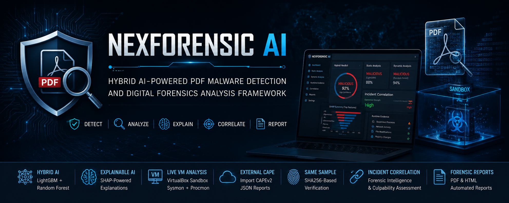
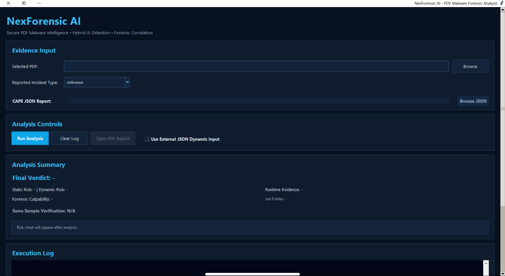
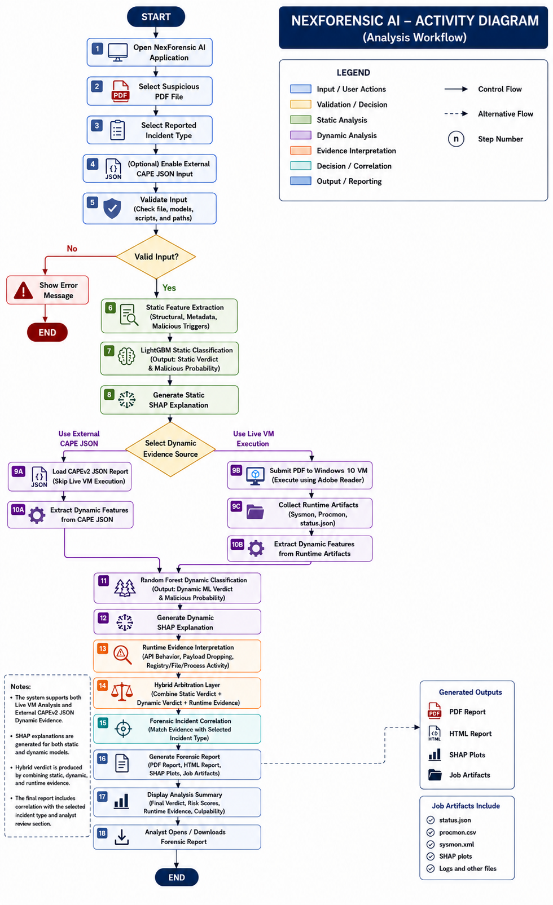
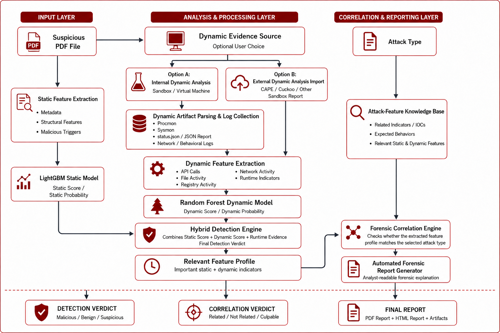
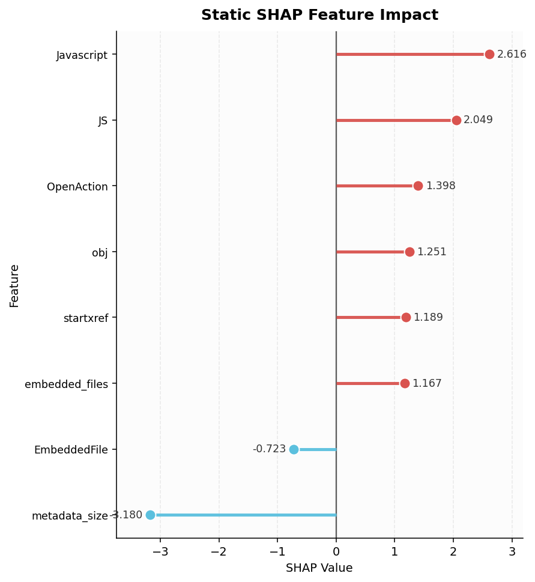
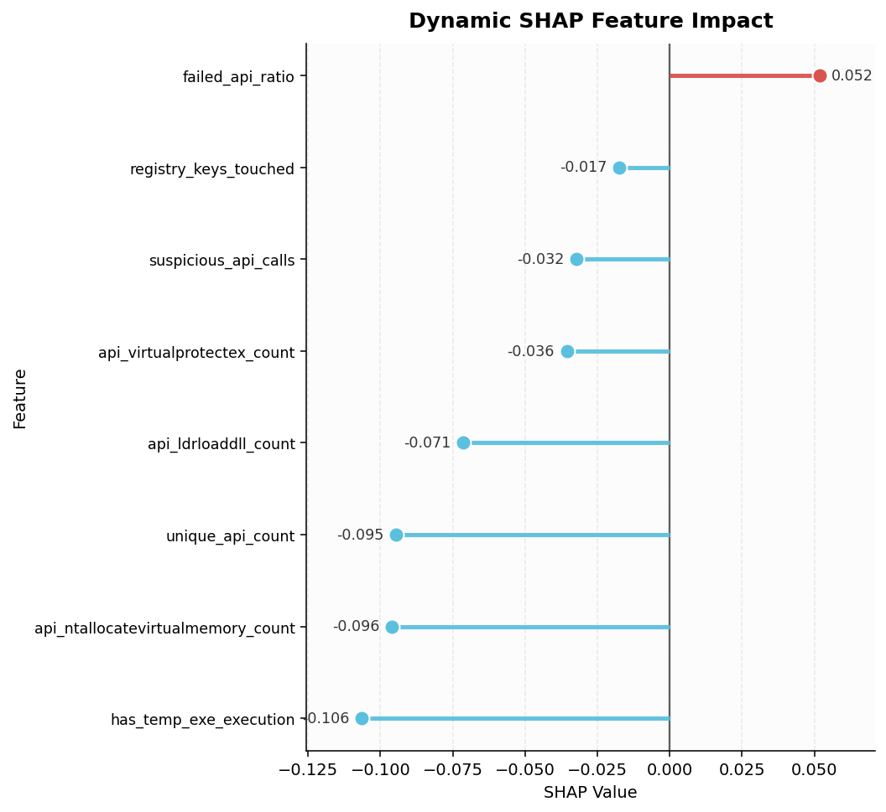
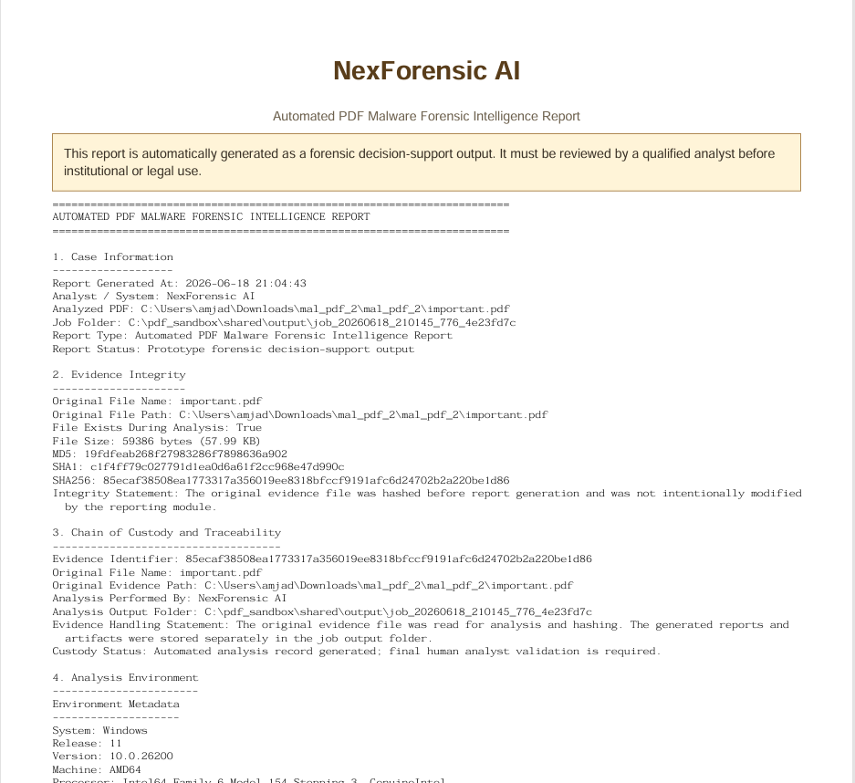
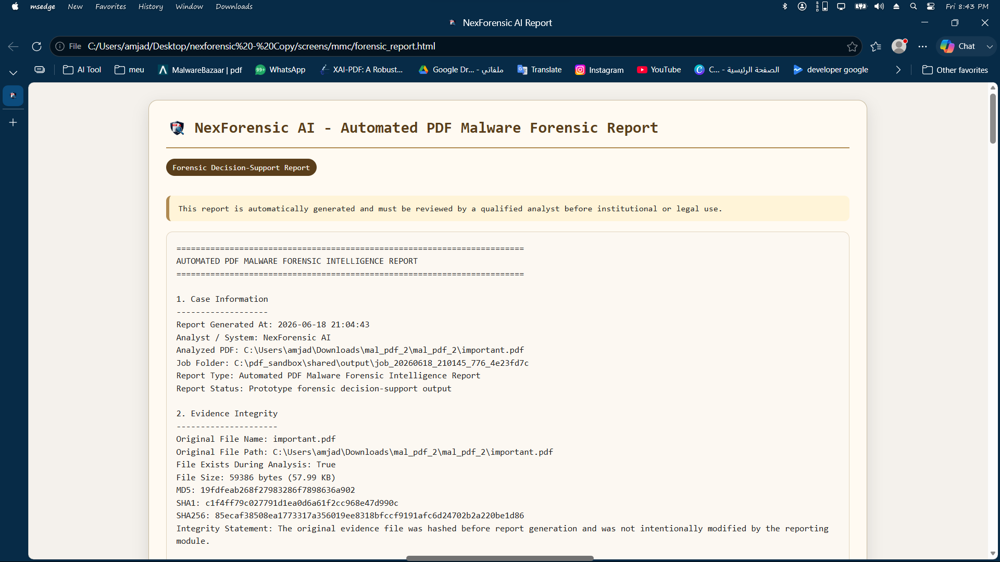

<p align="center">
  
</p>

> **AI-powered PDF Malware Detection • Dynamic Behavioral Analysis • Digital Forensics • Explainable AI**

# NexForensic AI

### Hybrid AI-Powered PDF Malware Detection and Digital Forensics Analysis Framework

<p align="center">


</p>

---

## Overview
<p align="center">

</p>

<p align="center">
<b>Figure 1. Main Desktop Interface</b>
</p>

NexForensic AI is a hybrid digital forensics framework designed to assist forensic analysts in the investigation of suspicious PDF documents by combining static analysis, dynamic behavioral analysis, explainable artificial intelligence, and forensic incident correlation within a single desktop application.

Unlike traditional malware detection systems that rely solely on static signatures or runtime behavior, NexForensic AI integrates multiple independent analysis stages to produce a unified forensic assessment while providing transparent evidence supporting every decision.

The framework combines two machine learning models:

* **LightGBM** for static PDF malware detection.
* **Random Forest** for dynamic behavioral analysis.

To improve analyst confidence, both models are supported by **SHAP (SHapley Additive exPlanations)**, allowing the framework to explain the most influential features that contributed to each prediction.

The system supports two independent dynamic analysis workflows:

1. **Live Virtual Machine Analysis**, where the submitted PDF is executed inside a controlled VirtualBox sandbox monitored using Sysmon and Procmon.

2. **External CAPE JSON Analysis**, where an existing CAPEv2 dynamic analysis report is imported directly without executing the PDF again.

When external behavioral evidence is supplied, the framework performs **Same Sample Verification** using SHA256 hashes to determine whether the uploaded PDF corresponds to the supplied CAPE report before incorporating dynamic evidence into the final forensic assessment.

Finally, NexForensic AI generates comprehensive forensic reports in both **PDF** and **HTML** formats containing static analysis, runtime evidence, explainable AI results, incident correlation findings, evidence integrity information, and final forensic conclusions.

---


# Key Features

* Hybrid PDF malware detection using both static and dynamic machine learning models.
* Static malware classification using a LightGBM classifier.
* Dynamic behavioral analysis using a Random Forest classifier.
* Live malware execution inside a controlled VirtualBox sandbox.
* External CAPEv2 JSON report support without requiring live execution.
* Runtime Evidence Interpreter for behavioral evidence evaluation.
* SHA256-based Same Sample Verification between uploaded PDFs and external CAPE reports.
* Explainable AI using SHAP for both static and dynamic predictions.
* Hybrid Decision Engine combining multiple evidence sources.
* Incident Correlation Engine for digital forensic case analysis.
* Forensic Culpability Assessment based on correlated evidence.
* Automated forensic report generation in PDF and HTML formats.
* Evidence integrity reporting including MD5, SHA1, and SHA256 hashes.
* Modern desktop graphical interface developed using Tkinter.

---

# Why NexForensic AI?

<p align="center">

</p>

<p align="center">
<b>Figure 2. Bridging PDF Malware Detection and Forensic Investigation</b>
</p>

Traditional PDF malware detection tools generally focus on either static characteristics or runtime behavior. This separation can reduce the analyst's ability to understand how multiple evidence sources relate to one another.

NexForensic AI addresses this limitation by integrating:

* Static PDF feature analysis.
* Dynamic behavioral evidence.
* Explainable machine learning.
* Runtime evidence interpretation.
* Digital forensic incident correlation.
* Same-sample verification.
* Automated forensic reporting.

The result is a unified forensic decision-support framework that provides both malware detection and contextual forensic intelligence while maintaining transparency throughout the analysis process.

---

# Main Capabilities

| Capability                      | Supported |
| ------------------------------- | --------- |
| Static PDF Analysis             | ✅         |
| Dynamic Behavioral Analysis     | ✅         |
| Hybrid AI Detection             | ✅         |
| Explainable AI (SHAP)           | ✅         |
| Runtime Evidence Interpretation | ✅         |
| Incident Correlation Engine     | ✅         |
| Same Sample Verification        | ✅         |
| Live Virtual Machine Analysis   | ✅         |
| External CAPEv2 JSON Analysis   | ✅         |
| PDF Report Generation           | ✅         |
| HTML Report Generation          | ✅         |
| Evidence Integrity Verification | ✅         |
| Desktop GUI                     | ✅         |

---

# Table of Contents

* Overview
* Key Features
* System Architecture
* Detection Workflow
* Technologies Used
* Machine Learning Models
* Runtime Evidence Interpreter
* Incident Correlation Engine
* Live VM Analysis
* External CAPE JSON Analysis
* Same Sample Verification
* Explainable AI
* Report Generation
* Installation
* Usage
* Project Structure
* Screenshots
* Future Improvements
* Authors
* License

---

# System Architecture
<p align="center">

</p>

<p align="center">
<b>Figure 3. System Architecture</b>
</p>

NexForensic AI follows a modular architecture where every stage of the forensic pipeline performs an independent task before contributing to the final forensic assessment.

The framework combines static feature extraction, dynamic behavioral analysis, explainable artificial intelligence, runtime evidence interpretation, and forensic incident correlation into a unified workflow.

The architecture consists of the following major components:

1. **Static Feature Extractor**
2. **Static AI Detection Model (LightGBM)**
3. **Dynamic Analysis Engine**
4. **Dynamic AI Detection Model (Random Forest)**
5. **Runtime Evidence Interpreter**
6. **Hybrid Decision Engine**
7. **Incident Correlation Engine**
8. **Same Sample Verification Module**
9. **Automated Forensic Report Generator**

The modular design allows each component to operate independently while sharing structured outputs with the following stages of the pipeline.

---

# Detection Workflow

The complete analysis pipeline consists of the following stages:

<p align="center">

</p>

<p align="center">
<b>Figure 4. NexForensic AI Detection Workflow</b>
</p>

---

# Technologies Used

| Category                 | Technology        |
| ------------------------ | ----------------- |
| Programming Language     | Python            |
| Desktop GUI              | Tkinter           |
| Static Machine Learning  | LightGBM          |
| Dynamic Machine Learning | Random Forest     |
| Explainable AI           | SHAP              |
| Data Processing          | Pandas, NumPy     |
| Machine Learning         | Scikit-learn      |
| Report Generation        | ReportLab         |
| PDF Parsing              | PyPDF2            |
| Virtualization           | Oracle VirtualBox |
| Runtime Monitoring       | Sysmon + Procmon  |
| Dynamic Sandbox Reports  | CAPEv2 JSON       |
| Operating System         | Windows           |

---

# Machine Learning Models

## Static Detection Model

The static detection stage analyzes structural characteristics extracted directly from the PDF document without executing the file.

The extracted features include structural metadata, embedded objects, JavaScript indicators, OpenAction entries, object streams, metadata fields, and multiple PDF-specific characteristics.

These features are processed by a trained **LightGBM classifier** that predicts whether the document is benign or malicious while producing a confidence score.

The prediction is subsequently explained using SHAP to identify the PDF features that contributed most significantly to the final classification.

---

## Dynamic Detection Model

The dynamic analysis stage evaluates runtime behavior rather than file structure.

The framework supports two independent execution modes:

### Live VM Analysis

The uploaded PDF is executed inside a controlled VirtualBox sandbox where runtime activities are monitored using Sysmon and Procmon.

Behavioral features are extracted from the generated monitoring artifacts before being evaluated by the Random Forest classifier.

---

### External CAPEv2 JSON Analysis

Instead of executing the document locally, NexForensic AI can import an existing CAPEv2 JSON report.

The system automatically extracts dynamic behavioral features from the report and evaluates them using the same Random Forest model employed during live VM analysis.

This mode is particularly useful when analysts already possess sandbox reports generated by external malware analysis platforms.

---

# Runtime Evidence Interpreter

Machine learning predictions alone are not sufficient for forensic investigations.

To improve interpretability, NexForensic AI includes a Runtime Evidence Interpreter that evaluates behavioral indicators extracted during dynamic analysis.

The interpreter analyzes multiple categories of runtime evidence, including:

* Suspicious process activity
* Network communication
* File system modifications
* Registry activity
* Memory allocation behavior
* Process injection indicators
* DLL loading activity
* Payload execution
* Temporary executable creation

These behavioral observations are summarized into an independent runtime evidence assessment before being forwarded to the Hybrid Decision Engine.

---

# Hybrid Decision Engine

The Hybrid Decision Engine combines information obtained from multiple independent sources:

* Static AI prediction
* Dynamic AI prediction
* Runtime Evidence Interpreter

Rather than relying on a single machine learning model, the engine correlates the available evidence to produce a unified forensic verdict.

When external CAPE JSON reports are used, the Hybrid Decision Engine also considers Same Sample Verification before integrating dynamic behavioral evidence into the final assessment.

---

# Explainable Artificial Intelligence (SHAP)

NexForensic AI incorporates SHAP (SHapley Additive exPlanations) to improve transparency and analyst trust.

Separate SHAP explanations are generated for:

* Static LightGBM predictions
* Dynamic Random Forest predictions

The generated explanations identify the most influential features contributing to each prediction and are included within the generated forensic reports.

This enables forensic analysts to understand why a particular document was classified as malicious or benign rather than relying solely on prediction probabilities.
---

# Incident Correlation Engine

Traditional malware detection systems typically stop after determining whether a file is malicious or benign. However, forensic investigations often require additional context regarding the possible incident associated with the analyzed evidence.

To address this requirement, NexForensic AI includes an Incident Correlation Engine that evaluates the relationship between the analyst's reported incident scenario and the evidence collected during static and dynamic analysis.

The engine correlates multiple evidence sources, including:

* Static PDF indicators
* Runtime behavioral features
* Hybrid AI decision
* Runtime evidence interpretation
* Same Sample Verification status (when external CAPE reports are used)

Based on these inputs, the engine produces:

* Correlation Strength
* Related Incident Indicators
* Forensic Culpability Assessment
* Evidence-Based Explanation

This provides analysts with contextual forensic intelligence rather than a simple malware classification.

---

# Same Sample Verification

When dynamic evidence is imported from an external CAPEv2 JSON report, NexForensic AI performs Same Sample Verification before incorporating the behavioral evidence into the final forensic assessment.

The verification process compares the SHA256 hash of the uploaded PDF with the SHA256 value stored inside the CAPEv2 report.

Possible outcomes include:

| Verification Status | Meaning                                                                                                                         |
| ------------------- | ------------------------------------------------------------------------------------------------------------------------------- |
| **Matched**         | The uploaded PDF and CAPE report correspond to the same analyzed sample.                                                        |
| **Not Matched**     | The uploaded PDF and CAPE report belong to different samples. Dynamic behavior is treated as external behavioral evidence.      |
| **Unknown**         | Same-sample verification could not be completed because the CAPE report does not contain sufficient identification information. |

This verification mechanism helps prevent incorrect attribution of runtime behavior to unrelated evidence and improves the forensic reliability of the final report.

---

# Automated Forensic Report Generation

Upon completion of the analysis, NexForensic AI automatically generates comprehensive forensic reports in both **PDF** and **HTML** formats.

The generated reports include:

* Evidence information
* Evidence integrity (MD5, SHA1, SHA256)
* Static analysis results
* Dynamic analysis results
* Runtime Evidence Interpreter findings
* SHAP explanations
* Hybrid decision
* Incident correlation results
* Same Sample Verification (when applicable)
* Generated runtime artifacts
* Final forensic conclusion

The reports are intended to support forensic investigations by providing a structured and explainable summary of all collected evidence.

---

# Installation

## Clone the repository

```bash
git clone https://github.com/amjad-altarefe/Nexforensic-AI.git

cd NexForensic-AI
```

---

## Install Python dependencies

```bash
pip install -r requirements.txt
```

---

## Configure the Virtual Machine (Optional)

Live dynamic analysis requires:

* Oracle VirtualBox
* Windows virtual machine
* Shared folder configuration
* Sysmon
* Procmon
* Adobe Reader

If the Live VM pipeline is not configured, users can still perform complete static analysis and dynamic behavioral analysis using external CAPEv2 JSON reports.

---
# Demo

The following demonstrates the complete NexForensic AI workflow.

- Upload a suspicious PDF.
- Select the reported incident scenario.
- Choose the dynamic analysis mode.
- Execute the analysis.
- Review the generated forensic reports.

---
# Running the Application

Start the graphical interface:

```bash
python NexForensic_AI_app.py
```

The application allows analysts to:

1. Select a suspicious PDF document.
2. Choose a reported incident scenario.
3. Select one of the available dynamic analysis modes.
4. Execute the complete forensic analysis.
5. Review generated forensic reports.

---

# Dynamic Analysis Modes

## Live Virtual Machine Analysis

The uploaded PDF is executed inside a controlled VirtualBox environment.

Behavioral monitoring is performed using Sysmon and Procmon before features are extracted and evaluated by the Random Forest model.

---

## External CAPEv2 JSON Analysis

Instead of executing the uploaded PDF locally, analysts may import an existing CAPEv2 JSON report.

Behavioral features are extracted directly from the report before being analyzed by the Random Forest classifier.

When this mode is selected, NexForensic AI automatically performs Same Sample Verification to determine whether the uploaded PDF corresponds to the supplied dynamic report.

---

# Project Structure

```text
NexForensic-AI
│
├── assets/
│
├── docs/
│   └── screenshots/
│
├── models/
│
├── tools/
│
├── NexForensic_AI_app.py
├── feature_extractor.py
├── dynamic_extractor.py
├── incident_correlation.py
├── forensic_report_generator.py
│
├── requirements.txt
├── README.md
├── LICENSE
└── .gitignore
```

---

# Screenshots

## Main Interface

<p align="center">

</p>

---

## Static Analysis

<p align="center">

</p>

---

## Dynamic Analysis

<p align="center">

</p>

---

## Generated PDF Report

<p align="center">

</p>

---

## HTML Report

<p align="center">

</p>

---

# Current Limitations

* The current implementation supports Windows hosts only.
* Live dynamic analysis requires a preconfigured VirtualBox environment.
* External CAPEv2 JSON reports depend on the information available within the supplied report.
* Same Sample Verification relies primarily on SHA256 identifiers.
* The framework currently focuses on malicious PDF document analysis.

---

# Future Improvements

Potential future enhancements include:

* Support for Linux and macOS hosts.
* Multi-sandbox integration.
* Cloud-based malware analysis.
* Additional machine learning models.
* Automated IOC extraction.
* YARA rule generation.
* MITRE ATT&CK technique mapping.
* Multi-file forensic case management.
* Timeline reconstruction.
* Threat intelligence integration.

Future versions aim to extend NexForensic AI into a complete forensic investigation platform capable of supporting additional malware formats, cloud sandbox integration, threat intelligence enrichment, and automated timeline reconstruction.

---

## Authors

### Amjad Emad Qandeel
- Lead Developer
- System Architecture
- AI Integration
- GUI Development
- Hybrid Detection Framework
- Digital Forensics Pipeline

### Sarah Fouad
- Co-Developer
- Machine Learning Development
- Model Training & Evaluation
- Experimental Validation
- Performance Analysis

Faculty of Information Technology  
Middle East University, Jordan

---

# License

This project is licensed under a **Custom Academic License**.

NexForensic AI is provided for educational, academic, and research purposes only.
Commercial use, redistribution, modification, or publication of modified versions is not permitted without prior written permission from both copyright holders.

See the [LICENSE](LICENSE) and [LICENSE-ACADEMIC.md](LICENSE-ACADEMIC.md) files for full license details.

---

# Example Analysis Workflow

The following example illustrates a typical forensic investigation performed using NexForensic AI.

### Step 1 — Select the Evidence

The forensic analyst selects a suspicious PDF document for analysis.

### Step 2 — Choose the Investigation Scenario

The analyst specifies the reported incident scenario, such as:

* Data Loss or Missing Files
* Unauthorized File Modification
* Suspicious Process Activity
* Data Exfiltration Suspected
* Phishing or Social Engineering
* Unknown

### Step 3 — Select the Dynamic Analysis Mode

The analyst may choose between:

* **Live Virtual Machine Analysis**
* **External CAPEv2 JSON Analysis**

### Step 4 — Execute the Analysis

The framework automatically performs:

* Static feature extraction
* Static AI classification
* Dynamic feature extraction
* Dynamic AI classification
* Runtime evidence interpretation
* Hybrid decision generation
* Incident correlation
* Same Sample Verification (if applicable)
* Forensic report generation

### Step 5 — Review the Results

The analyst reviews:

* Static Verdict
* Dynamic Verdict
* Runtime Evidence
* Hybrid Verdict
* SHAP Explanations
* Incident Correlation Results
* Forensic Culpability Assessment
* Generated Reports

---

# Example Output

The generated forensic report contains structured sections including:

```text
Evidence Information
Evidence Integrity

Analysis Environment

Static Analysis

Dynamic Analysis

Runtime Evidence Interpreter

Static SHAP Explanation

Dynamic SHAP Explanation

Hybrid Decision

Incident Correlation

Generated Runtime Artifacts

Executive Summary

Final Forensic Conclusion
```

---

# Datasets

The machine learning models were trained using publicly available malware datasets together with custom feature engineering.

## Static Analysis

The static model was trained using structural PDF features extracted from malicious and benign PDF documents.

The extracted features include PDF metadata, JavaScript indicators, OpenAction entries, embedded objects, object streams, cross-reference information, and additional structural characteristics.

The LightGBM classifier performs binary classification between benign and malicious PDF documents.

---

## Dynamic Analysis

The dynamic model was trained using behavioral features extracted from malware execution logs.

Behavioral indicators include:

* Process activity
* Network communication
* Registry modifications
* File system activity
* Memory allocation
* API usage
* DLL loading
* Payload execution
* Runtime behavioral statistics

The Random Forest classifier predicts malicious or benign runtime behavior using these extracted behavioral features.

---

# Research Contributions

The main contributions of NexForensic AI include:

* A hybrid AI framework combining static and dynamic malware detection.
* Integration of explainable artificial intelligence using SHAP.
* Runtime Evidence Interpreter for behavioral reasoning.
* Same Sample Verification using SHA256 for external sandbox reports.
* Incident Correlation Engine for forensic case analysis.
* Automated forensic report generation in both PDF and HTML formats.
* Unified desktop application integrating the complete forensic workflow.

---

# Security Notice

NexForensic AI is intended for defensive cybersecurity research, malware analysis, and digital forensics investigations.

The project should only be used in authorized laboratory environments or controlled virtual machines.

The authors assume no responsibility for misuse of the software or for unauthorized execution of malicious samples outside controlled environments.

---

# Citation

If you use this project for academic research, please cite it as:

```text
Amjad Emad Qandeel.

NexForensic AI:
Hybrid AI-Powered PDF Malware Detection and Digital Forensics Analysis Framework.

Graduation Project,
Faculty of Information Technology,
Bachelor of Cybersecurity.
```

---

# Acknowledgments

The development of NexForensic AI benefited from several open-source technologies and publicly available research resources.

Special thanks to the developers and researchers behind:

* Python
* Scikit-learn
* LightGBM
* SHAP
* ReportLab
* Oracle VirtualBox
* Sysmon
* Procmon
* CAPEv2 Sandbox
* The cybersecurity research community for publicly available malware datasets and academic resources.

---

# Repository Status

| Component                     | Status     |
| ----------------------------- | ---------- |
| Desktop Application           | ✅ Complete |
| Static Analysis Engine        | ✅ Complete |
| Dynamic Analysis Engine       | ✅ Complete |
| Runtime Evidence Interpreter  | ✅ Complete |
| Hybrid Decision Engine        | ✅ Complete |
| Incident Correlation Engine   | ✅ Complete |
| Same Sample Verification      | ✅ Complete |
| PDF Report Generation         | ✅ Complete |
| HTML Report Generation        | ✅ Complete |
| SHAP Explainability           | ✅ Complete |
| Live Virtual Machine Analysis | ✅ Complete |
| External CAPEv2 JSON Support  | ✅ Complete |

---

<p align="center">

**NexForensic AI**
Hybrid AI-Powered PDF Malware Detection and Digital Forensics Analysis Framework

Developed as a Cybersecurity Graduation Project.

</p>

